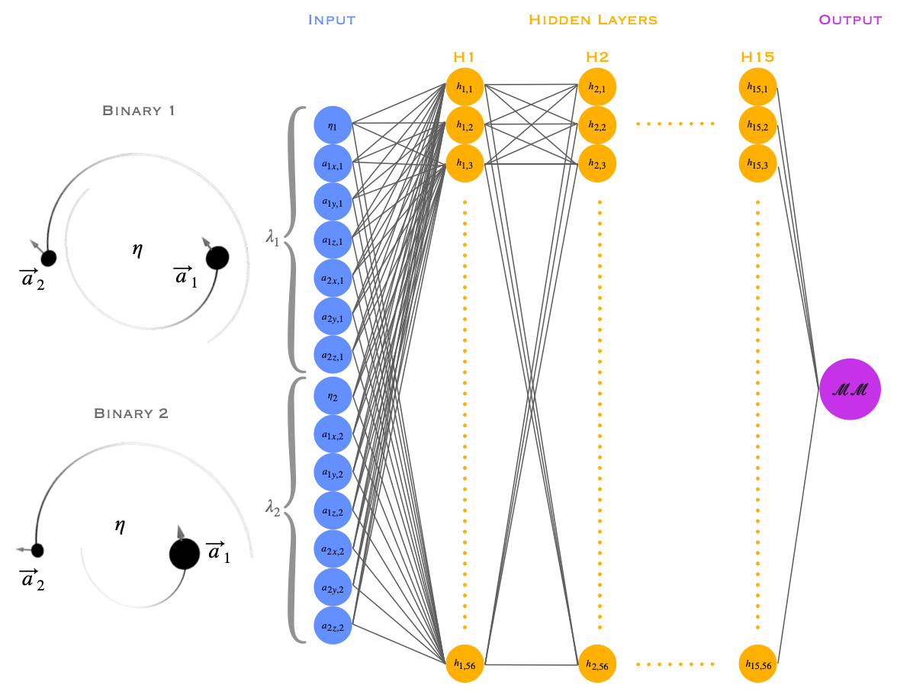

# Mismatch Predicting Neural Network

The neural network included in this repository predicts the mismatch between the gravitational waves emitted from any two binary black hole systems with symmetric mass ratio, $\eta > 0.0826$ ( $q=m_1 / m_2 \leq 10$ ).

The network and its uses are described in the paper by Deborah Ferguson at XX.

This repository includes two jupyter notebooks to serve as examples of how to use this network.

predict_mismatch.ipynb: predict the mismatch between two binary black hole systems by setting their initial parameters and feeding them into the network.

predict_many_mismatches: predict the mismatches between many pairs of binary systems by setting their initial parameters and feeding multiple pairs into the network at once.

## Network overview

The network inputs the initial parameters that describe two binary black hole systems.
This includes their symmetric mass ratio ( $\eta$ ) and the dimensionless spin components for each black hole ( $\mathbf{a_1}$ and $\mathbf{a_2}$ ).
$\mathbf{a_1}$ and $\mathbf{a_2}$ are each 3-dimensional vectors, consisting of x-, y-, and z- components.
We define $\lambda = \eta,\, \mathbf{a_{1}}, \, \mathbf{a_{2,}}$ as the initial parameters of a binary system.
The network inputs $\lambda_1$ and $\lambda_2$ and outputs the mismatch between the gravitational waves emitted by the two systems. This is shown in the diagram included below.

The mismatch between two gravitational waves is defined as:

$$\mathcal{MM} = 1 - \max_{t,\, \phi} \mathcal O[h_1, h_2]  \equiv  1 - \max_{t,\, \phi} \frac{\langle h_1|h_2 \rangle}{\sqrt{\langle h_1|h_1\rangle \langle h_2|h_2\rangle}}$$

where

$$\langle h_{1}|h_{2} \rangle = 2\int_{f_{0}}^\infty\frac{h_{1}^*h_{2} +h_{1}\,h_{2}^*}{S_{n}} df$$

and $h_1$ and $h_2$ are the strain of the gravitational waves emitted by the two systems respectively. 
$S_n$ is the one-sided power spectral density of the detector.
This network is trained on a flat noise curve with $S_n = 1$ at all frequencies.

This network was built using tensorflow. 
It is fully connected, consisting of 15 hidden layers with 56 nodes per layer, as described in the figure below.

It has been trained on the SXS public catalog of numerical relativity waveforms (https://data.black-holes.org/waveforms) using the $\ell = 2$, $m = 2$ mode.

## Credit

If you use this network, please cite XX with the bibtex entry:

## Dependencies

Using this network will require tensorflow and numpy. 

A requirements.txt is included in this repository. You can use this to pip install all the necessary libraries with the command:

`pip install -r requirements.txt`
